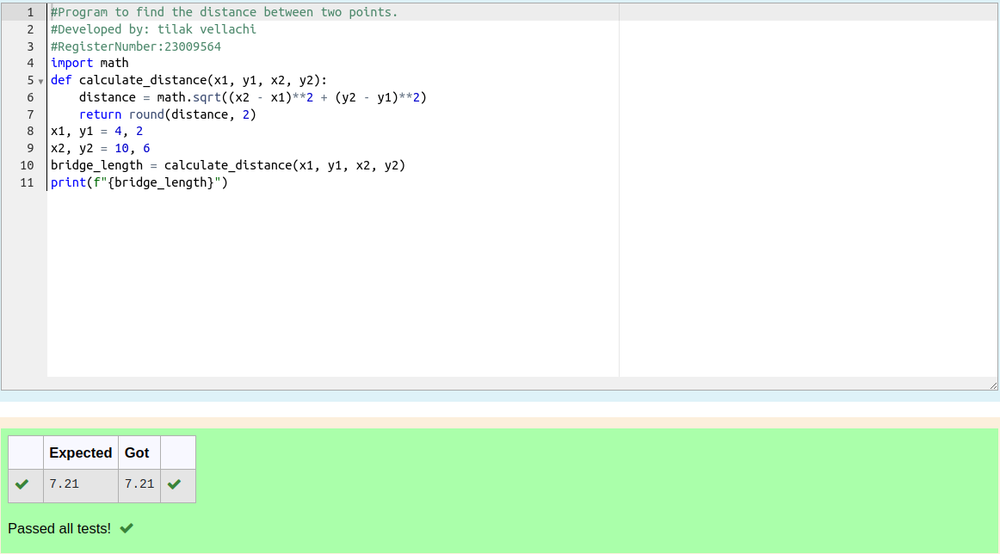

# DISTANCE-BETWEEN-TWO-POINTS

## AIM:
To write a python program to find the distance two 2 points
## ALGORITHM:
### Step 1: 
start the program
### Step 2: 
assign values for the values x2,x1,y2,y1
### Step 3:
Substitute the values in the distance formula formula

### Step 4:
print the distance format to display the answer with two decimal points
### Step 5:
end the program

### PROGRAM:
  ```
  #Program to find the distance between two points.
#Developed by: tilak vellachi   
#RegisterNumber:23009564
import math
def calculate_distance(x1, y1, x2, y2):
    distance = math.sqrt((x2 - x1)**2 + (y2 - y1)**2)
    return round(distance, 2)
x1, y1 = 4, 2
x2, y2 = 10, 6
bridge_length = calculate_distance(x1, y1, x2, y2)
print(f"{bridge_length}")
```


### OUTPUT:



### RESULT:
Thus the python program for distance-bettween-two-points is excuted successfully.
